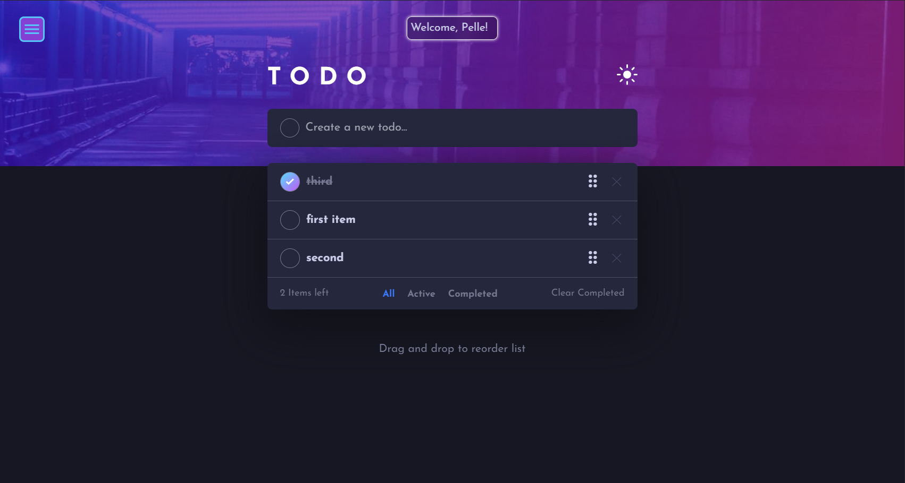

# Frontend Mentor - Todo app solution

This is a solution to the [Todo app challenge on Frontend Mentor](https://www.frontendmentor.io/challenges/todo-app-Su1_KokOW). Frontend Mentor challenges help you improve your coding skills by building realistic projects.

I have expanded the Frontend Mentor challange quite a bit, with the biggest expansion being that I made it a **fullstack web application**. The backend is implemented with Google's Firebase backend-as-a-service platform. This app utilizes Cloud Firestore, Firebase Authentication and Firebase Hosting, enabling users to sign up and log in (by email or with the Google provider) and create their own todo items. 👍

## Overview

### The challenge

Users should be able to:

- View the optimal layout for the app depending on their device's screen size
- See hover states for all interactive elements on the page
- Add new todos to the list
- Mark todos as complete
- Delete todos from the list
- Filter by all/active/complete todos
- Clear all completed todos
- Toggle light and dark mode
- **Bonus**: Drag and drop to reorder items on the list
- **Bonus, added by me**: Users should be able to log in and use their own data💁‍♂️

### Design

### Screenshot

### Links

- Solution URL: [Solution](./solution/)
- Live Site URL: [Live site](https://frontendmentor-todo-5b99b.web.app/)

### Built with

- [React](https://reactjs.org/)
- [Firebase](https://firebase.google.com/) (Cloud Firestore, Firebase Authentication and Firebase Hosting)
- TypeScript
- [Tailwind CSS](https://tailwindcss.com/) - Utility-first CSS framework
- [Vite](https://vitejs.dev/) - JavaScript build tool for optimized application
- Mobile-first workflow

## Author

- LinkedIn - [Daniel Westerlund](https://www.linkedin.com/in/daniel-westerlund-a07529179/)
- Website - [GitHub Pages](https://danielw720.github.io/)
- Frontend Mentor - [@DanielW720](https://www.frontendmentor.io/profile/yourusername)
